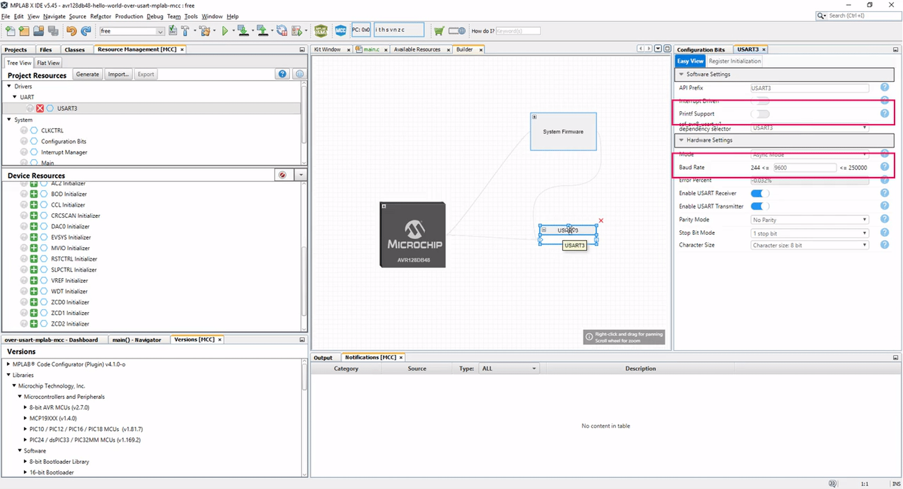
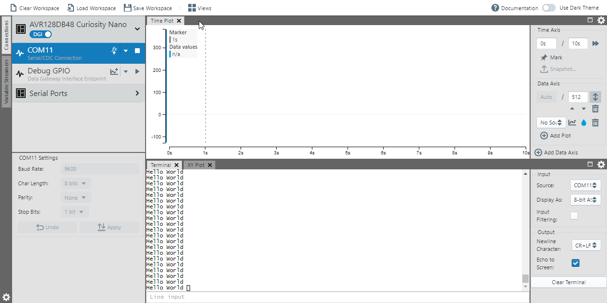

<!-- Please do not change this logo with link -->
[](https://www.microchip.com)

# AVR128DB48 USART "Hello World!" Code Example

This example shows how to configure the Universal Synchronous and Asynchronous serial Receiver and Transmitter (USART) on the AVR128DB48 Curiosity Nano to print Hello World in the Data Visualizer using driver in MPLAB Code Configurator (MCC).


## Related Documentation

- [MPLAB Code Configurator](https://www.microchip.com/en-us/development-tools-tools-and-software/embedded-software-center/mplab-code-configurator)
- [AVR DB Family Product Page](https://www.microchip.com/en-us/products/microcontrollers-and-microprocessors/8-bit-mcus/avr-mcus/avr-db)
- [AVR128DB48 Hardware User Guide](https://www.microchip.com/DevelopmentTools/ProductDetails/PartNO/EV35L43A)

## Software Used

- [MPLAB® X IDE](http://www.microchip.com/mplab/mplab-x-ide) **5.45** or newer 
- [MPLAB® XC8](http://www.microchip.com/mplab/compilers) **2.32** or a newer compiler 
- [MPLAB® Data Visualizer](https://www.microchip.com/en-us/development-tools-tools-and-software/embedded-software-center/mplab-data-visualizer) **1.1.799** or newer
- [MPLAB® Code Configurator (MCC)](https://www.microchip.com/mplab/mplab-code-configurator) **4.1.0** or newer 
- [MPLAB® Melody Library](https://www.microchip.com/mplab/mplab-code-configurator) **1.37.22** or newer 
- AVR-Dx_DFP **1.6.88** or newer Device Pack

## Hardware Used

- [Microchip AVR128DB48 Curiosity Nano Evaluation Kit](https://www.microchip.com/DevelopmentTools/ProductDetails/PartNO/EV35L43A)
## Setup

MCC with the Melody library was used to implement this example as shown in the following section.

### Hardware User Guide

To be able to configure the USART for printing, we would read the [Hardware User Guide](https://www.microchip.com/DevelopmentTools/ProductDetails/PartNO/EV35L43A) - Chapter 5 with the pinout.


The hardware user guide shows that **USART3** is connected to Virtual Serial Port (CDC) that acts as a general purpose bridge between the host PC and target device. This means we will be selecting USART3 for this example.

### USART Configuration 

Open up MCC by clicking the blue **MCC** button


In the *Device Resources* scroll down to Drivers, select *UART* and choose *USART3* in the list.


Select *USART3* in the image in the middle, then click on the button for *printf support*. This will make it possible to use the *printf* statement in C and get the output to the Data Visualizer.

- Note that the baud rate is here set to **9600**.  



### Generating project

1. Right click on **Generate** button & click **Force update on all**.
1. Left Click **Generate** button.

The files have now been generated and the only thing you would have to update now is to add the printf statement in **main.c**.
- The printf has been added already by convenience. 
  
The main file shows two different approaches to write over USART. 

The first approach handles everything automaticly by doing all the necessary checks before sending the data. The only thing needed is to make sure to configure for printing on the USART.

The second approach checks the status register if the DREIF flag is set, which signals that the TXDATA register is empty and ready for new data.
The nice thing about the second approach is having more control, when it is needed.

```c
#define STRING_END '\0'

int main(void)
{
    SYSTEM_Initialize();

    while(1)
    {
        /* Configured USART3 for printing, so this is one way of 
         * writing text over USART. 
         */
        printf("Hello ");
        
        /* Another way is to use the USART3_Write function directly
         * Can also be used to send uint8_t values directly */
        char world[] = "World \r\n";
        for(uint8_t i = 0; world[i] != STRING_END; i++){
            /* Checks if USART3 is ready to send data */
            while(!USART3_IsTxReady());
            USART3_Write(world[i]); 
        }
        
    }    
}
```

### Data Visualizer

Makre sure to flash the device. Flashing the device is done using the play-button


To see the output from the device, we would like to use the *Data Visualizer*.  
The **Data Visualizer** needs to be installed from Tools -> plugins.


Start the Data Visualizer by pressing the green **Data Visualizer** button at the top.


- Fill out baud rate of **9600** and choose the correct COM-port on the right side.  
  

## Operation

After having flashed the application to the AVR128DB48 Curiosity Nano, you should be able to see continous printing of hello world using the Data Visualizer.   



## Summary

The example has shown how MCC can be used to easily configure the USART of the AVR DB device and how to get the output to the Data Visualzier.
